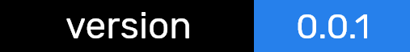

<p align="center"></p>

<p align="center">
  
</p>


# Modular Development Skeleton
Most frontend frameworks do too much. MDS doesn't have even half of that.
Uses <a href="https://www.webcomponents.org/introduction" target="_blank" rel="noopener noreferrer">webcomponents</a>.
[Find a demo here](http://www.uzairfasih.me/Modular-Division-Skeleton/dist/)

* Supports Hot Reload

## Getting Started

### Installing

Download or clone this repo.
```
git clone https://github.com/Uzair-Fasih/Modular-Division-Skeleton.git
```

Install dependencies.
```
npm i --save
```

## Usage

### Setup

All of your html should go in the `/src` folder.
All the components should have their names in camel case and have the `.htm` extension.

```
# SampleComponent.htm
# TestComponent.htm
```

### Format

Like VueJS, you can create `.htm` components like so.

```HTML
<!-- SampleComponent.htm -->
<template>
  <div onload="logMessage">
    <p class="sample">SampleComponent</p>
  <div>
</template>

<style>
.sample {
  color: blue;
}
</style>

<script>
function logMessage () {
  console.log('Hello from MDS 👋')
}
</script>
```

Finally use your module in your index.html

```HTML
<html>
  <body>
    <sample-component></sample-component>
  <body>
</html>
```

### Serve

Start the server and serve. 

```
 npm run mds
```

## Contributing

As of now, the project lacks direction and will be continued to be updated. You can contribute by suggesting features or by making changes that reflect and extend the idea of the project.

## Authors

* **Uzair Fasih** - *Initial Commit*

## License

This project is licensed under the MIT License
